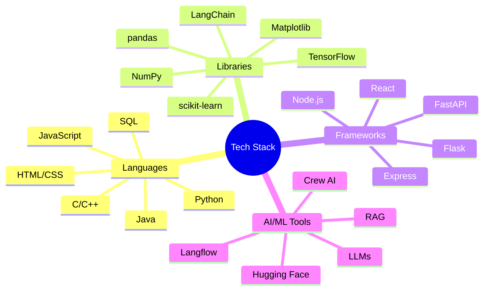

  

# 👋 Hi, I'm Piyush Sahoo!

> A passionate Computer Science student and tech enthusiast from Bangalore, crafting innovative solutions through code.

  

  
  
  
  
  
  
  

## 🎓 Education

- **B.Tech in Computer Science and Engineering** | PES University, Bangalore
  - CGPA: 8.63
- **Grade 12** | Geetanjali School, Bangalore
  - Score: 93.8%
- **Grade 10** | Orchids The International School, Bangalore
  - Score: 92.2%

## 💻 Technical Arsenal

### Languages & Tools

### Technology Stack & Tools

  
  
  
  
  
  

### Technology Badges

## 🚀 Featured Projects

### 🔍 Research on Finding Research Gap
- Leveraging LLMs and LangChain for academic research analysis
- Implementing AI model selection through data-driven approaches
- Timeline: May 2024 - Present

### 🤖 PHOTON - Personal Desktop Assistant
- JARVIS-inspired assistant using Groq and Llama model
- Agent-based task management with tool invocation
- Timeline: Nov 2023 - Present

### ✍️ Blog Research and Writing Automation
- CrewAI-powered content generation system
- Integrated YouTube content extraction
- Timeline: Nov 2023 - Present

## 🏆 Awards & Experience

### Founder @ Apna Meetup
- Organizing free technical workshops across Bangalore colleges
- Fostering tech community growth
- Timeline: July 2024 - Present

### Intern @ CODMAV
- Machine learning research and development
- Timeline: April 2024 - August 2024

### 1st Place - CodeChef's Clash of Codes Hackathon
- PES University, April 2024

## 💪 Core Strengths

- **Problem Solving**: Competitive programming enthusiast
- **Data Structures**: Strong algorithmic foundation
- **Web Development**: Frontend specialist
- **Public Speaking**: Engaging presenter

## 📊 GitHub Stats

  
  

  
  

---

  <i>Let's connect and build something amazing together! 🚀</i>

